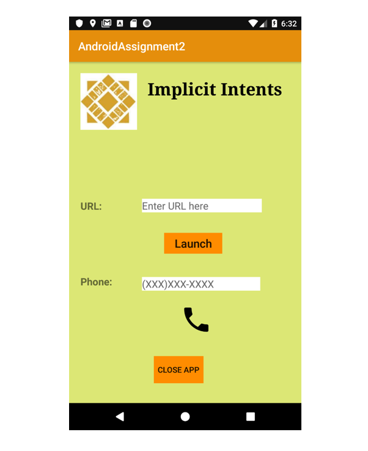
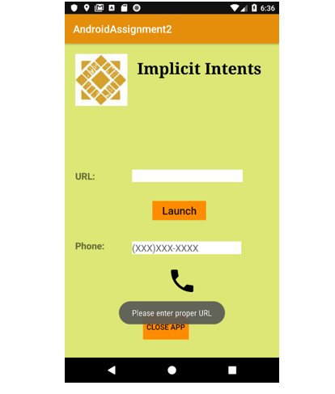
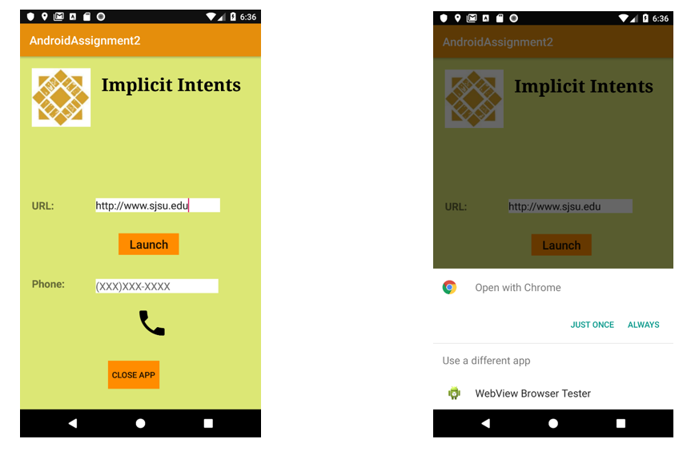
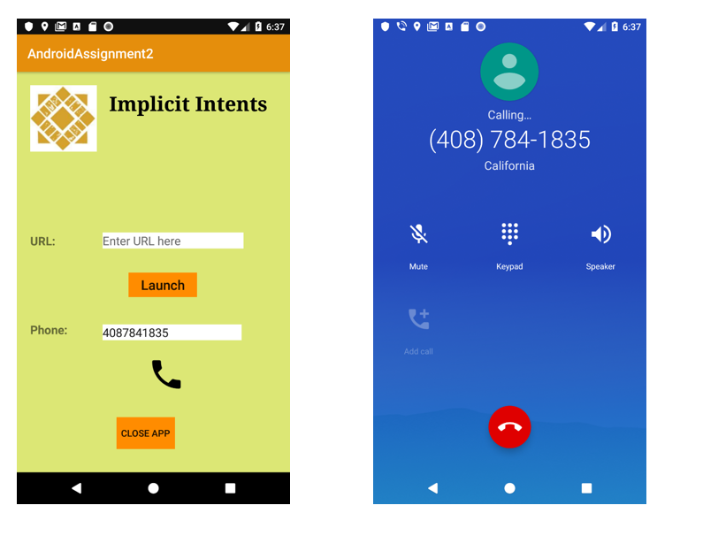

Implicit Intent - WebLinkAndPhoneCallApp
===

Objective: the goal of the assignment is to apply implicit intent concepts and invoke web link & phone calls.
---

Intents can be specified as asynchronous messages which allows application components such as activities, content providers, broadcast receivers, services, etc. to request functionalities from other android components. 

There are two types of Intents:

1.	Explicit Intent
2.	Implicit Intent

---

1.	Explicit Intent:
-	Explicit Intent requires target’s app name or fully classified component class name to satisfy the intent.

2.	Implicit Intent:
-	Implicit Intent requires to declare a general action to perform, which will be satisfied by other components from another app.

In this assignment, we will see how implicit intents work through two examples by invoking web link and by calling a phone app.

1)	This is the home screen of Android App which allows user to invoke the user entered URL and make call to the specified phone number.

2)	If user clicks on Launch button without entering the URL, app throws a message to enter proper URL.

3)	I have used uri.parse() method to invoke the web url.

4)	To make a phone call, app will ask user permission and then will direct the call to main phone app.

