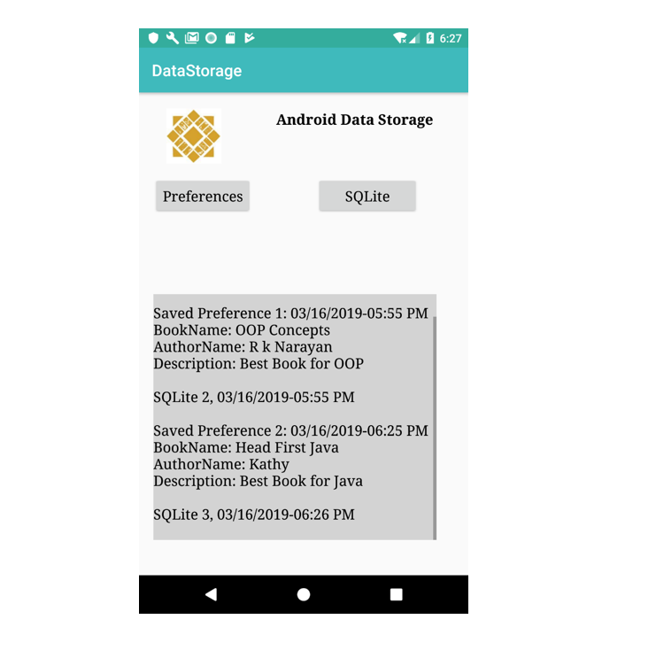
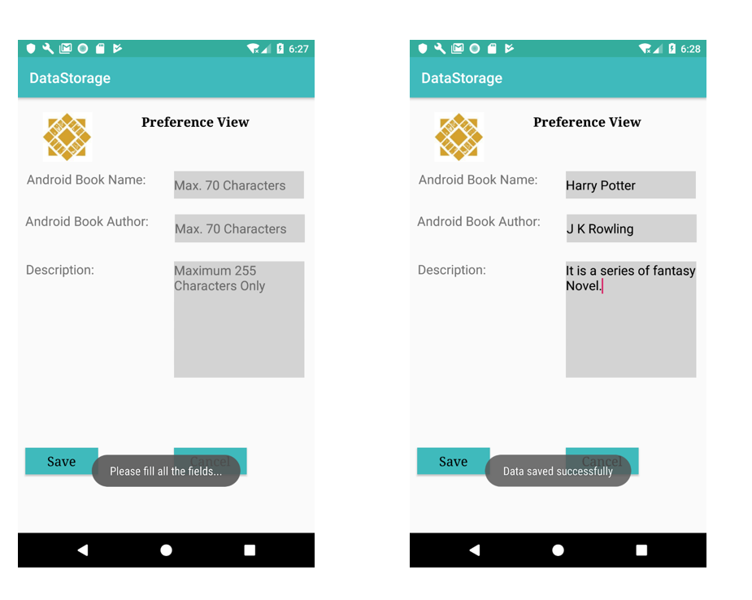
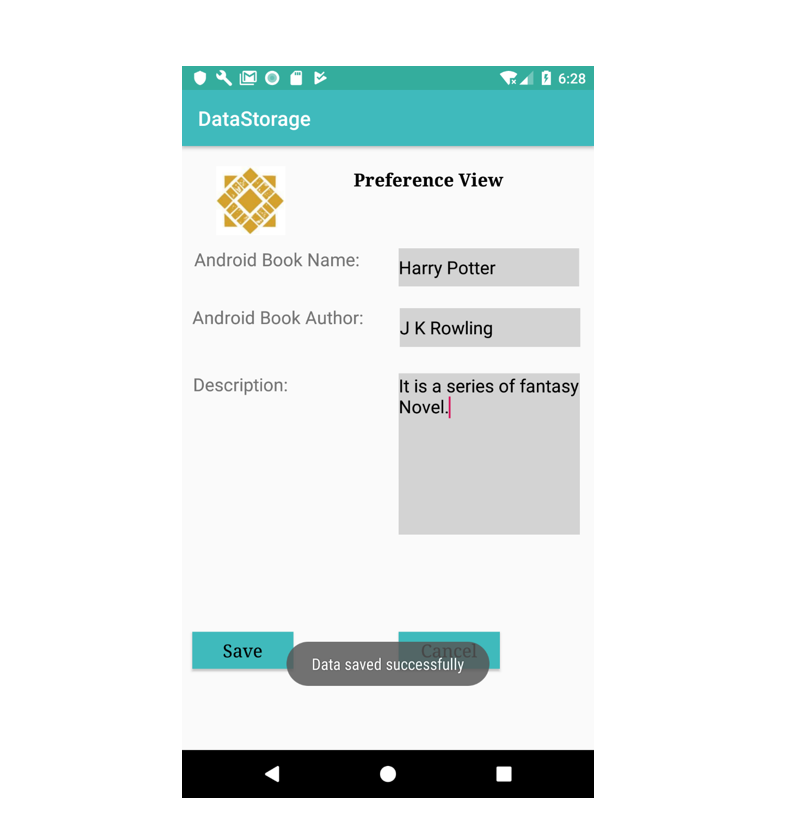
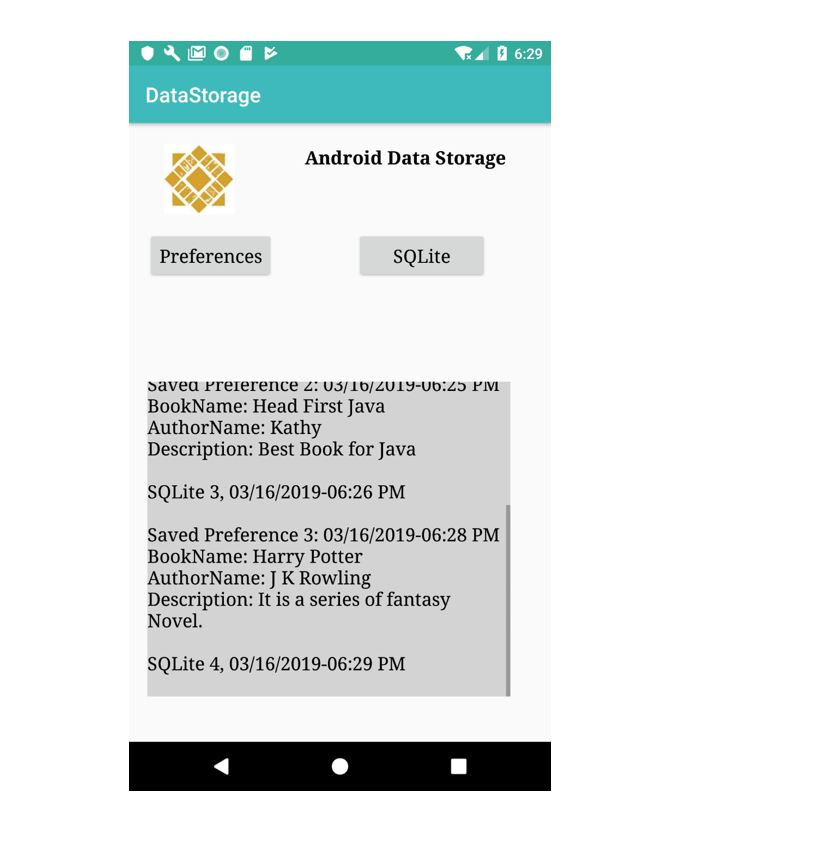

Data Storage in Android 
===

Objective: Apply Android shared preferences & SQLite storage techniques.
---

1)	This is the Home Screen of data storage application. Text field is displaying the data stored in shared preferences file along with the timestamp.

2)	This is a Shared Preferences view where user is storing the Book data in Shared Preference file i.e. Test.xml

3)	We are using SQLite database to store Blog message here.

4)	Data in shared preference file and the corresponding timestamp is shown in the output text field.

