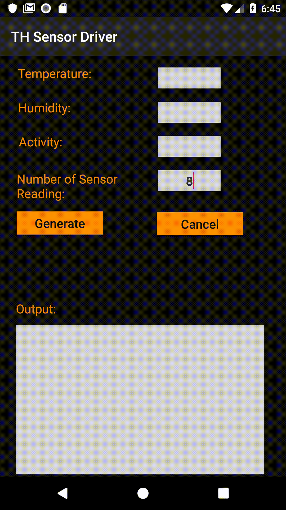
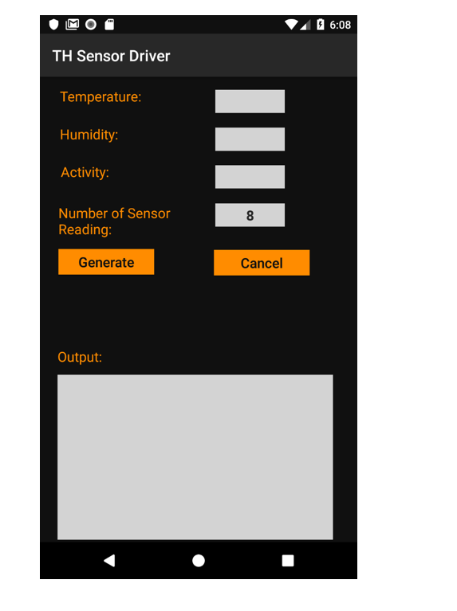
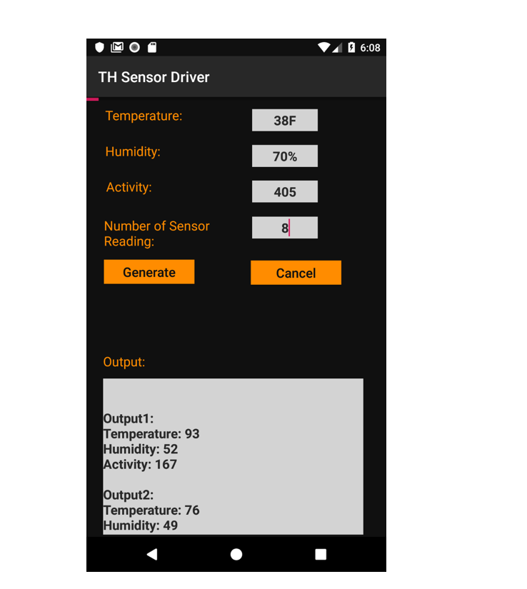
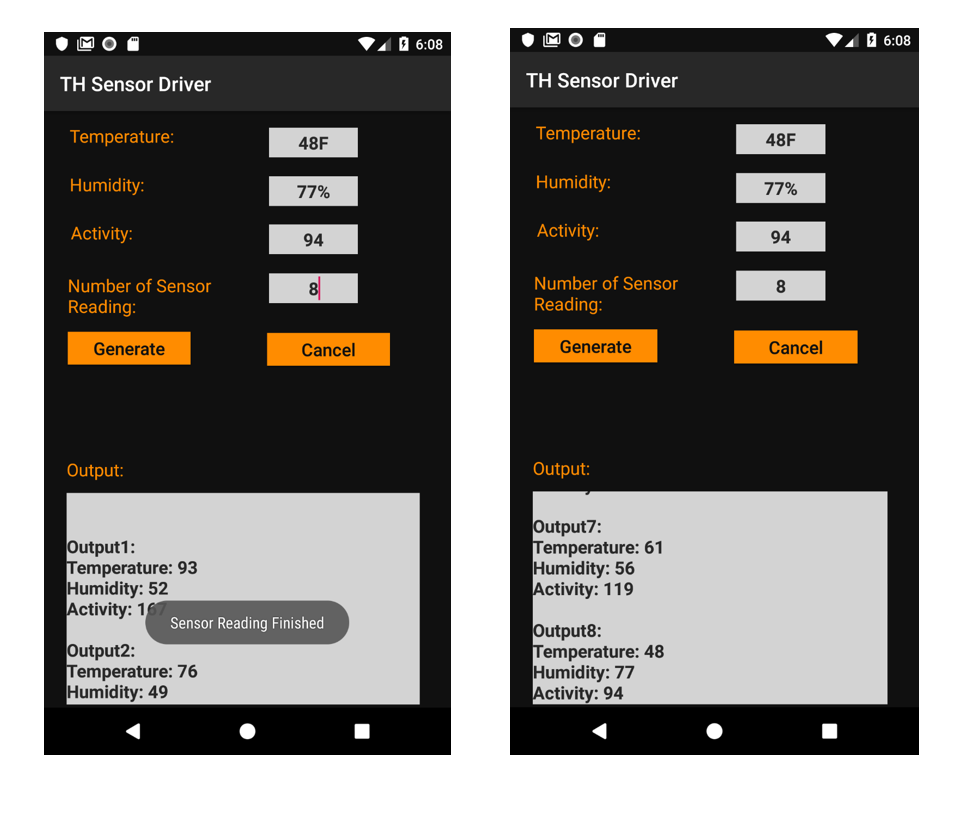
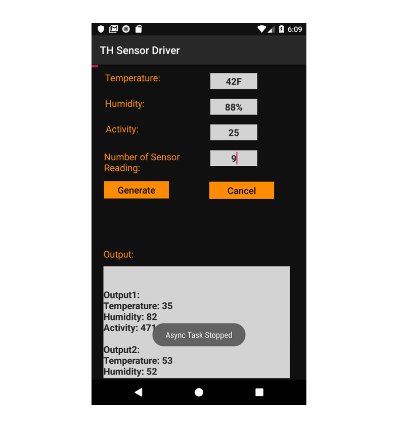

Temperature Humidity Sensor Driver App using Async Task
===

Objective: Using Async Task one can run tasks that take longer than five seconds in the context of UI. The objective of the assignment is to generate sensor readings in the UI Thread context and update UI for each reading.
---

[{:height="50%" width="50%"}]((https://youtu.be/xozrM6W5SV0))

1)	This is the home screen of TH Sensor Driver App where we are taking number of sensors reading from user.

2)	After clicking on Generate button, Async task starts in which we are generating random values for Temperature, Humidity, Activity. 
3)	As soon as Async task gets started, progress bar is visible to user showing the progress of our task on the top most part of the screen.
4)	One by One, output is shown in the Text fields as well as in the Output field.

5)	After completing the Async task, a Toast message is displayed on the screen.

6) 6)	Async Task gets cancelled if we click on Cancel button.

